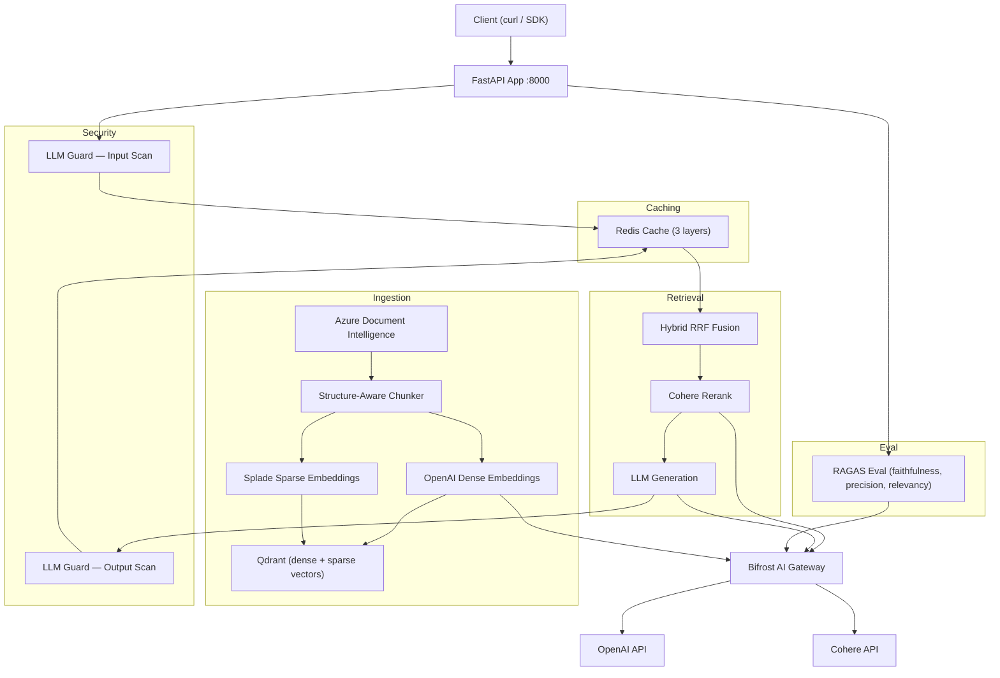

# RAG Hackathon Backend

Production-grade Retrieval-Augmented Generation backend built with Python 3.13 and FastAPI.

**One command to run the full stack:** `docker compose up`

## Architecture



### Stack

| Component | Technology | Purpose |
|-----------|-----------|---------|
| API server | FastAPI (async) | REST endpoints |
| Document parsing | Azure Document Intelligence | Structure + bbox extraction |
| Chunking | Structure-Aware Chunker | Section-bounded + table-as-chunk |
| Dense embeddings | OpenAI `text-embedding-3-small` | 1536-dim cosine vectors |
| Sparse embeddings | Splade (local) | Sparse lexical vectors |
| Vector store | Qdrant | Named vectors + RRF fusion |
| Reranking | Cohere `rerank-english-v3.0` | Cross-encoder re-scoring |
| Generation | GPT (via Bifrost) | Grounded answer synthesis |
| Security | LLM Guard sidecar | Input/output scanning |
| Gateway | Bifrost AI Gateway | Proxies all provider traffic |
| Caching | Redis | 3-tier TTL cache |
| Observability | Logfire + structlog | JSON logs + distributed traces |
| Eval | RAGAS | Faithfulness, context precision, answer relevancy |

## Prerequisites

- Docker + Docker Compose
- API keys:
  - [Azure Document Intelligence](https://portal.azure.com/#create/Microsoft.CognitiveServicesFormRecognizer)
  - [OpenAI](https://platform.openai.com/api-keys)
  - [Cohere](https://dashboard.cohere.com/api-keys)
  - [Logfire](https://logfire.pydantic.dev/) (free tier works)

## Quickstart

```bash
# 1. Clone and configure
cp .env.example .env
# Edit .env with your API keys

# 2. Start the stack
docker compose up

# 3. Verify health
curl http://localhost:8000/health
```

The stack takes ~60s to become healthy. All five services (app, Qdrant, Redis, Bifrost, LLM Guard) must pass health checks before the app accepts traffic.

## API Reference

Interactive docs available at `http://localhost:8000/docs` (Swagger UI).

### `POST /ingest`

Upload a PDF for async ingestion. Returns a `job_id` for polling.

```bash
curl -X POST http://localhost:8000/ingest \
  -H "X-Request-Id: $(uuidgen)" \
  -F "file=@document.pdf" \
  -F "doc_id=my-doc-1"
```

Response:
```json
{
  "job_id": "01J...",
  "doc_id": "my-doc-1",
  "version_id": "01J..."
}
```

### `GET /jobs/{job_id}`

Poll ingestion job status.

```bash
curl http://localhost:8000/jobs/01J... -H "X-Request-Id: $(uuidgen)"
```

Response:
```json
{
  "job_id": "01J...",
  "doc_id": "my-doc-1",
  "version_id": "01J...",
  "state": "done",
  "stage": "done",
  "progress": 100,
  "error": null
}
```

States: `pending` → `running` (stages: `parsing` → `chunking` → `embedding_dense` → `embedding_sparse` → `indexing`) → `done` | `failed`

### `POST /api/v1/query`

Query the RAG pipeline with hybrid retrieval + reranking + grounded generation.

```bash
curl -X POST http://localhost:8000/api/v1/query \
  -H "Content-Type: application/json" \
  -H "X-Request-Id: $(uuidgen)" \
  -d '{
    "query": "What are the caching layers?",
    "doc_ids": ["my-doc-1"],
    "top_k": 20,
    "top_n": 5
  }'
```

Response:
```json
{
  "answer": "The system uses three Redis caching layers...",
  "citations": [
    {
      "doc_id": "my-doc-1",
      "version_id": "01J...",
      "page": 3,
      "section_path": ["Introduction", "Architecture"],
      "bbox": [0.1, 0.2, 0.8, 0.4],
      "chunk_text": "The caching architecture consists of...",
      "score": 0.95
    }
  ],
  "request_id": "abc-123",
  "timings_ms": {"retrieve_ms": 120, "rerank_ms": 85, "generate_ms": 340},
  "warnings": []
}
```

**Optional filters:**
- `doc_ids` — restrict retrieval to specific documents
- `version_ids` — query specific versions (bypasses active filter)
- `top_k` — candidates from hybrid retrieval (default: 20)
- `top_n` — final results after reranking (default: 5)

### `PUT /documents/{doc_id}`

Re-ingest a document with a new version. The new version becomes active automatically.

```bash
curl -X PUT http://localhost:8000/documents/my-doc-1 \
  -H "X-Request-Id: $(uuidgen)" \
  -F "file=@document-v2.pdf"
```

### `DELETE /documents/{doc_id}`

Delete document points from Qdrant.

```bash
# Soft delete (marks inactive, still queryable via version_ids)
curl -X DELETE "http://localhost:8000/documents/my-doc-1?mode=soft"

# Hard delete (removes points + invalidates caches)
curl -X DELETE "http://localhost:8000/documents/my-doc-1?mode=hard"

# Delete specific version only
curl -X DELETE "http://localhost:8000/documents/my-doc-1?mode=soft&version_id=01J..."
```

### `POST /eval/run`

Run RAGAS evaluation (faithfulness, context_precision, answer_relevancy) against the bundled golden set.

```bash
curl -X POST http://localhost:8000/eval/run -H "X-Request-Id: $(uuidgen)"
```

Response:
```json
{
  "total_questions": 5,
  "failed_questions": 0,
  "elapsed_seconds": 12.4,
  "aggregate": {
    "faithfulness": 0.85,
    "context_precision": 0.78,
    "answer_relevancy": 0.91
  },
  "per_question": [...]
}
```

Results are also persisted to `eval-results/YYYY-MM-DD-HHMMSS/` as JSON + Markdown.

### `GET /health`

Health check endpoint. Returns `{"status": "ok"}`.

## Document Versioning

All Qdrant points carry `(doc_id, version_id, active)` payload. Default retrieval filters `active == True`.

- **Re-ingest** creates a new version and flips `active` atomically
- **Soft delete** marks points `active=False` (queryable via explicit `version_ids`)
- **Hard delete** removes points and bumps a cache epoch to invalidate cached answers
- Old versions remain queryable by passing `version_ids` in the query request

## Security

- **Input scanning:** Prompt injection, PII anonymization, toxicity, banned topics, token limits
- **Output scanning:** Factual consistency (NLI), sensitive content, relevance
- Input block → `400` with error details
- Output concern → `warnings` array in response (does not block)

## Observability

- **Logfire** — distributed traces with per-stage spans (`parse`, `retrieve.hybrid`, `rerank`, `generate`, `guard.input`, `guard.output`)
- **structlog** — JSON-structured logs with request ID correlation
- Every response includes `timings_ms` for latency breakdown

## Configuration

All settings are env-var driven. See `.env.example` for the full list.

| Variable | Required | Default | Description |
|----------|----------|---------|-------------|
| `AZURE_DI_ENDPOINT` | Yes | — | Azure DI resource endpoint |
| `AZURE_DI_KEY` | Yes | — | Azure DI API key |
| `OPENAI_API_KEY` | Yes | — | OpenAI API key |
| `COHERE_API_KEY` | Yes | — | Cohere API key |
| `LOGFIRE_TOKEN` | Yes | — | Logfire token |
| `BIFROST_URL` | No | `http://localhost:8080` | Bifrost gateway URL |
| `LLM_GUARD_URL` | No | `http://localhost:8001` | LLM Guard sidecar URL |
| `QDRANT_URL` | No | `http://localhost:6333` | Qdrant URL |
| `REDIS_URL` | No | `redis://localhost:6379/0` | Redis URL |
| `LLM_MODEL` | No | `gpt-5.4` | LLM model for generation |
| `SPARSE_ENABLED` | No | `true` | Enable/disable sparse channel |
| `CACHE_TTL_ANSWER` | No | `3600` | Answer cache TTL (seconds) |

## Running Tests

```bash
# Install dev dependencies
uv sync

# Run all tests
uv run pytest tests/ -v

# Lint
uv run ruff check src/ tests/
```

## Troubleshooting

| Issue | Cause | Fix |
|-------|-------|-----|
| App crashes on start | Missing required env vars | Check all 5 required keys in `.env` |
| Splade OOM on low-RAM machines | SPLADE model loads into memory | Set `SPARSE_ENABLED=false` in `.env` |
| Bifrost health check fails | Bifrost image pull or config error | Check `docker/bifrost/config.json` has valid provider keys |
| LLM Guard OOM | FactualConsistency is memory-heavy | Remove `FactualConsistency` from `docker/llm-guard/scanners.yml` |
| Ingest stuck at `embedding_sparse` | First Splade run downloads model | Wait; subsequent runs use cached model |
| Cache misses after version flip | Expected — version hash changes | Normal behavior; cache rebuilds on next query |

## Low-Memory Mode

For machines with <16 GB RAM, set in `.env`:

```bash
SPARSE_ENABLED=false
```

This skips sparse embedding at both ingest and retrieve, falling back to dense-only retrieval. No code changes required.

## Project Structure

```
src/rag_hackathon/
├── api/                    # FastAPI routes, schemas, middleware
│   ├── routers/            # ingest, query, documents, eval, health
│   ├── services/           # QueryService orchestration
│   └── schemas.py          # Pydantic request/response models
├── cache/                  # Redis cache (3-tier TTL)
├── core/                   # Settings, types, errors
├── eval/                   # RAGAS eval runner + golden set
├── generation/             # Grounded LLM generation
├── gateway/                # Bifrost AI Gateway client
├── ingestion/              # Parser, chunker, embedders, indexer, jobs
├── observability/          # Logfire spans, structlog config
├── retrieval/              # Hybrid Qdrant retriever, Cohere reranker
├── security/               # LLM Guard client (input/output)
└── versioning/             # Document version manager
```
