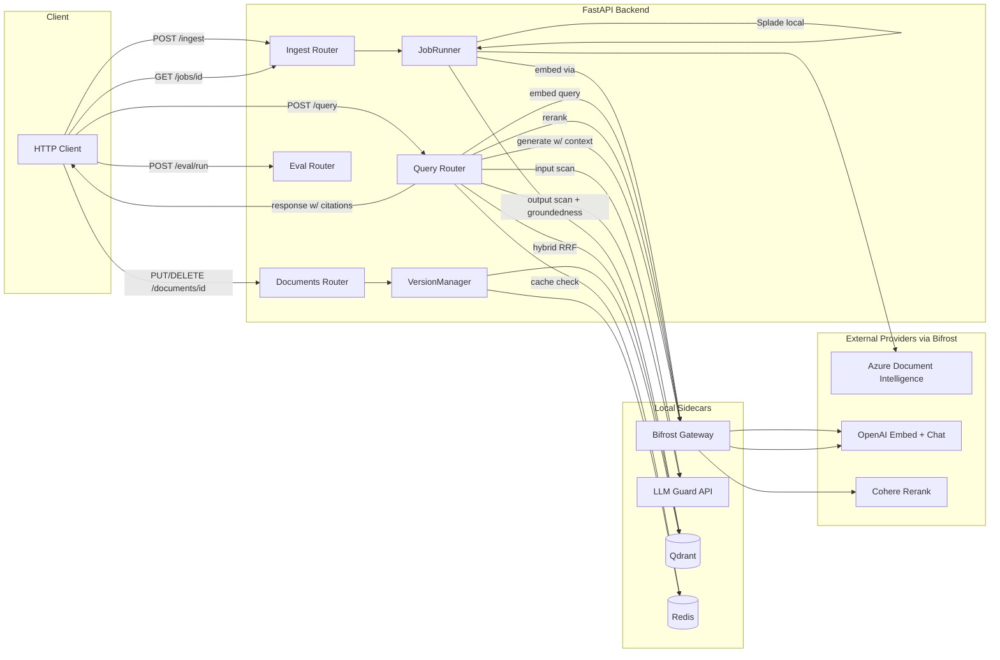

# feat: Production-Grade RAG Hackathon Backend

## Summary

Build the FastAPI backend across 18 implementation units organized into seven phases: foundation scaffolding (settings, logging, observability, docker-compose) → ingestion pipeline (Azure DI parse → structure-aware chunking → dense + Splade embedding → Qdrant index with versioning payload, async job runner) → retrieval and generation (hybrid RRF + Cohere rerank + lineage-rich response) → security layer (LLM Guard input/output, Bifrost gateway client) → caching and document lifecycle (Redis layers, versioning, update, soft/hard delete) → eval (RAGAS endpoint + golden set) → polish (docker-compose finalization, README, demo script). Each phase ends with a runnable, demonstrable slice.

---

## Problem Frame

Greenfield repo (only `main.py`, `pyproject.toml`, Python 3.13, `uv` toolchain). The brainstorm settled the WHAT (see origin); this plan settles the HOW: module boundaries, sequencing, integration shape between Bifrost / LLM Guard / Qdrant / Redis, and which pieces ship in which phase so the demo is incrementally proveable rather than a big-bang reveal.

---

## Requirements

- R1. FastAPI async backend, Python 3.13, `uv`-managed (origin R1)
- R2. Azure Document Intelligence parser preserving structure + bbox (origin R2)
- R3. Pluggable structure-aware chunker — section-bounded + token cap + table-as-chunk (origin R3, R19)
- R4. Hybrid retrieval: OpenAI dense + Splade sparse, RRF fusion in Qdrant (origin R4)
- R5. Cohere rerank stage on fused candidates (origin R5)
- R6. Generation with retrieved chunks as grounding context (origin R6)
- R7. Response payload returns `citations[]` with `doc_id`, `page`, `section_path`, `bbox`, `chunk_text`, `score` (origin R7)
- R8. Async ingestion API: `POST /ingest` → `job_id`, `GET /jobs/{job_id}` → status (origin R8)
- R9. LLM Guard input scanners (prompt injection, PII, toxicity) and output scanners (groundedness vs cited chunks, sensitive leak) (origin R9)
- R10. Bifrost gateway proxies all OpenAI + Cohere traffic via OpenAI-compatible REST surface (origin R10)
- R11. Redis caches: query-embedding, Cohere rerank, final-answer (keyed on query + filters + active versions); per-layer TTL (origin R11)
- R12. Document versioning: `(doc_id, version_id, active)` payload on all Qdrant points; default filter targets latest active (origin R12)
- R13. Update endpoint = re-ingest same `doc_id` → new version + cache invalidation (origin R13)
- R14. Delete endpoint: soft = mark inactive; hard = purge points + caches (origin R14)
- R15. `POST /eval/run` runs RAGAS faithfulness / context_precision / answer_relevancy on bundled golden set (origin R15)
- R16. Logfire instrumentation with explicit per-stage spans (origin R16)
- R17. structlog JSON logging with request-id correlation (origin R17)
- R18. `docker compose up` brings up FastAPI + Qdrant + Redis + Bifrost + LLM Guard sidecar (origin R18)
- R19. Strategy interfaces for chunker / embedder / retriever / reranker / generator / guard / gateway client (origin R19)
- R20. Pydantic v2 boundary contracts (origin R20)

---

## Scope Boundaries

- Frontend / UI work
- AuthN / AuthZ / multi-tenant isolation
- Prometheus / Grafana / OTel collector (Logfire is the chosen substitute)
- Kubernetes manifests, CI/CD, load testing
- Hosted / cloud Qdrant
- Token-streaming SSE responses
- Embedding / rerank fine-tuning
- Domain-specific extractors beyond Azure DI defaults

### Deferred to Follow-Up Work

- Frontend (web UI) for citation rendering — separate plan
- Switching `JobRunner` from `BackgroundTasks` to arq/celery — deferred to a post-hackathon hardening pass

---

## Context & Research

### Relevant Code and Patterns

- Greenfield repo. No existing patterns. Project layout is established by U1 of this plan.
- `pyproject.toml` is `uv`-managed, Python 3.13. All deps added via `uv add`.

### Institutional Learnings

- None — first plan in this repo.

### External References

- **Bifrost AI Gateway** — runs as a Go sidecar (`maximhq/bifrost` Docker image) exposing an OpenAI-compatible REST surface at `http://bifrost:8080/openai`. Cohere rerank is first-class via `POST /v1/rerank`. Pin to a post-April-2026 image for Cohere v2 rerank fixes. OTel exporter available for later observability hardening.
- **LLM Guard** — `laiyer/llm-guard-api` sidecar (FastAPI) recommended over in-process to avoid model-loading bloat in the RAG service. ~16 GB RAM recommended. `FactualConsistency` scanner is NLI-based (deBERTa) with a ~512-token window — long retrieved contexts must be chunked with max-entailment aggregation. Wraps Bifrost on both input and output sides; do **not** also enable Bifrost's own guardrails plugin (double-billing latency).
- Azure Document Intelligence Python SDK: `azure-ai-documentintelligence` — returns `AnalyzeResult` with `pages`, `paragraphs`, `tables`, `sections`, each carrying `bounding_regions` for bbox.
- Qdrant `qdrant-client[fastembed]`: supports named sparse + dense vectors on the same point and server-side RRF fusion via `query_points` with prefetch.
- Logfire: `logfire.instrument_fastapi()`, `logfire.instrument_httpx()`, `logfire.instrument_pydantic()`. Manual spans via `with logfire.span("stage"): ...`.
- structlog → Logfire bridge: configure structlog `processors` to emit JSON, then route through Logfire's stdlib logging integration.

---

## Key Technical Decisions

- **Layout.** `src/rag_hackathon/` package with submodules `api/`, `ingestion/`, `retrieval/`, `generation/`, `security/`, `gateway/`, `cache/`, `versioning/`, `eval/`, `observability/`, `core/` (settings, errors, types). `tests/` mirrors. Each submodule exposes a `protocols.py` defining its strategy `Protocol` so swaps don't touch the API layer.
- **Bifrost client wrapper.** A single `gateway.bifrost.BifrostClient` wraps the `openai` SDK at `base_url=settings.bifrost_url + "/openai"` for chat + embeddings (OpenAI-compat path), and a thin `httpx` call to `settings.bifrost_url + "/v1/rerank"` (root path, **not** under `/openai`) for Cohere rerank. All provider traffic goes through this one class.
- **Chunker contract.** `Chunker.chunk(parsed: ParsedDocument) -> list[Chunk]`. `ParsedDocument` is the Azure DI normalized form (sections, paragraphs, tables, bbox preserved). Default impl is `StructureAwareChunker`. Strategy registry exposed in `ingestion/chunkers/__init__.py`.
- **Hybrid in Qdrant via named vectors.** Collection `documents` is created with two named vectors: `dense` via `VectorParams(size=1536, distance=Distance.COSINE)` and `sparse` via `SparseVectorParams(index=SparseIndexParams(on_disk=False))`. Each point carries `vectors={"dense": [...], "sparse": qdrant_client.models.SparseVector(indices=[...], values=[...])}`. Query uses Qdrant's prefetch + fusion: prefetch top-K dense and top-K sparse, fuse with RRF server-side, then return top-N for rerank.
- **Splade asymmetric encoders.** SPLADE efficient-VI-BT-large is asymmetric (separate doc and query checkpoints). Settings expose `SPLADE_DOC_MODEL` (default `naver/efficient-splade-VI-BT-large-doc`) and `SPLADE_QUERY_MODEL` (default `naver/efficient-splade-VI-BT-large-query`). `SparseEmbedder` is constructed in two flavors at app startup — `app.state.sparse_doc_embedder` (used by ingestion) and `app.state.sparse_query_embedder` (used by retrieval). Using the wrong encoder for the wrong side silently degrades quality.
- **Deterministic Qdrant point ids.** Point id = `uuid.uuid5(NAMESPACE_RAG, f"{doc_id}:{version_id}:{chunk_index}")` where `NAMESPACE_RAG` is a fixed UUID constant in `core/types.py`. Produces canonical RFC-4122 UUID strings (Qdrant-compatible) and is collision-resistant + idempotent on re-upsert.
- **Versioning payload model.** Every point's payload includes `doc_id: str`, `version_id: str` (timestamp-based ULID), `active: bool`, `page: int`, `section_path: list[str]`, `bbox: list[float]`, `chunk_text: str`, `chunk_type: "text" | "table"`. Chunk content is immutable once written; only the `active` flag mutates across version transitions. Retrieval filter rules:
  - Default (no explicit `version_ids` in query): `active == True` AND optional `doc_id` membership.
  - Explicit `version_ids` supplied: filter by `version_ids` membership; `active` flag is **ignored** so older versions remain queryable.
  
  "Update" = ingest new version + flip prior versions of the same `doc_id` to inactive only after the new version is fully indexed.
- **Redis cache layering.** Three logical caches with separate TTLs and key prefixes:
  - `embed:q:<sha256(query)>` — query embedding (TTL 24h)
  - `rerank:<sha256(query + candidate_ids)>` — Cohere rerank result (TTL 6h)
  - `answer:<sha256(query + filters + active_version_hash + doc_cache_epoch)>` — full response (TTL 1h)

  Where `active_version_hash = sha256(sorted(active_version_ids_in_scope))` — read from a Redis-maintained index, not computed by scanning Qdrant. `VersionManager` owns the index: a Redis hash `doc:active:{doc_id} -> version_id` is updated atomically on every flip (`HSET` + `INCR doc:epoch:{doc_id}` in the same pipeline). Query path uses `MGET` over the relevant `doc:active:*` keys to compose the active set in O(N) docs without touching Qdrant.

  Two complementary invalidation mechanisms:
  - **Version-flip invalidation** — flipping a doc's active version changes `doc:active:{doc_id}` and bumps `doc_cache_epoch`; the answer cache key recomputes and misses naturally.
  - **Hard-delete invalidation** — `doc_cache_epoch` is a per-`doc_id` integer in Redis (`doc:epoch:{doc_id}`) bumped on every hard delete. Including it in the answer cache key invalidates all cached answers referencing that `doc_id` without scanning Redis keyspace.
- **LLM Guard sidecar over HTTP.** `security.guard.LLMGuardClient` calls `http://llm-guard:8000/scan/prompt` and `/scan/output`. For groundedness on long context, the client chunks retrieved text into ≤512-token slices, fans out the per-slice POSTs concurrently with `asyncio.gather`, then aggregates: `is_valid = all(slice.is_valid for slice in slices)`, `score = max(slice.score for slice in slices)`. Concurrency keeps wall-clock latency close to a single-slice call regardless of context size.
- **Query orchestration extracted as a service.** The query pipeline (input scan → cache → embed → retrieve → rerank → generate → output scan → cache store) lives in `api/services/query_service.py` as `QueryService.run(req: QueryRequest) -> QueryResponse`. Both the FastAPI `POST /query` route handler and the eval runner (`POST /eval/run`) call this service directly with their own `Settings`/`app.state` dependencies — the route handler stays thin, and the eval runner avoids re-wiring FastAPI dependency injection.
- **Async job runner abstraction.** MVP ships with `BackgroundTasksRunner` (FastAPI `BackgroundTasks`) behind the `JobRunner` protocol, with a Redis-backed `JobStore` for status. This is the active implementation, not deferred. Migration to arq/celery is the deferred follow-up; the protocol exists to make that swap a localized change.
- **Settings.** `pydantic-settings` with a single `Settings` class, env-var driven, loaded once at startup. Secrets (Azure DI key, OpenAI key, Cohere key) only in env, never in code or logs.
- **Observability stack order.** `Logfire.configure()` → `instrument_fastapi(app)` → `instrument_httpx()` → structlog configured to feed Logfire via stdlib logging. Each pipeline stage opens a child span; spans carry `doc_id`, `job_id`, `query_hash` attributes.

---

## Open Questions

### Resolved During Planning

- Bifrost deployment shape: sidecar Docker container, OpenAI-compatible REST.
- LLM Guard deployment shape: sidecar (`llm-guard-api`).
- Hybrid fusion: Qdrant server-side RRF via prefetch + fusion query.
- Citation marker style: separate `citations[]` array, no inline markers.
- Background runner: FastAPI `BackgroundTasks` behind `JobRunner` interface.
- Versioning model: payload-filter on a single collection, not collection-per-version.

### Deferred to Implementation

- Concrete Splade model variant — start with `naver/efficient-splade-VI-BT-large-doc`; downsize if local CPU latency unacceptable.
- LLM Guard scanner thresholds — start at library defaults, tune from RAGAS feedback.
- Final RAGAS golden-set Q&A — assembled during U15 from a representative seed corpus.
- Whether to expose a separate `/query/stream` endpoint later — not in MVP.

---

## Output Structure

    rag-hackathon/
    ├── docker-compose.yml
    ├── Dockerfile
    ├── pyproject.toml
    ├── .env.example
    ├── README.md
    ├── docs/
    │   ├── brainstorms/2026-05-02-rag-hackathon-backend-requirements.md
    │   └── plans/2026-05-02-001-feat-rag-hackathon-backend-plan.md
    ├── docker/
    │   ├── bifrost/config.json
    │   └── llm-guard/scanners.yml
    ├── src/rag_hackathon/
    │   ├── __init__.py
    │   ├── api/
    │   │   ├── app.py                 # FastAPI factory
    │   │   ├── routers/
    │   │   │   ├── ingest.py          # POST /ingest, GET /jobs/{id}
    │   │   │   ├── documents.py       # PUT /documents/{id}, DELETE /documents/{id}
    │   │   │   ├── query.py           # POST /query
    │   │   │   ├── eval.py            # POST /eval/run
    │   │   │   └── health.py
    │   │   ├── services/
    │   │   │   └── query_service.py   # QueryService orchestrator
    │   │   └── schemas.py             # Pydantic boundary models
    │   ├── core/
    │   │   ├── settings.py            # pydantic-settings
    │   │   ├── errors.py
    │   │   └── types.py               # ParsedDocument, Chunk, Citation, RetrievalHit, Answer
    │   ├── ingestion/
    │   │   ├── parser.py              # AzureDIParser
    │   │   ├── chunkers/
    │   │   │   ├── protocols.py
    │   │   │   └── structure_aware.py
    │   │   ├── embedders/
    │   │   │   ├── protocols.py
    │   │   │   ├── openai_dense.py
    │   │   │   └── splade_sparse.py
    │   │   ├── indexer.py             # Qdrant upsert with named vectors
    │   │   └── jobs.py                # JobRunner, JobStore
    │   ├── retrieval/
    │   │   ├── protocols.py
    │   │   ├── hybrid_qdrant.py       # RRF prefetch + fusion query
    │   │   └── reranker_cohere.py
    │   ├── generation/
    │   │   ├── protocols.py
    │   │   ├── prompt.py              # context-injection prompt + citation formatting
    │   │   └── generator.py
    │   ├── security/
    │   │   ├── protocols.py
    │   │   └── guard.py               # LLMGuardClient (HTTP sidecar)
    │   ├── gateway/
    │   │   └── bifrost.py             # BifrostClient
    │   ├── cache/
    │   │   ├── protocols.py
    │   │   └── redis_cache.py
    │   ├── versioning/
    │   │   └── manager.py             # VersionManager (Qdrant + cache invalidation)
    │   ├── eval/
    │   │   ├── ragas_runner.py
    │   │   └── golden_set.json
    │   └── observability/
    │       ├── logging.py             # structlog config + Logfire bridge
    │       └── tracing.py             # logfire setup, stage-span helpers
    └── tests/
        ├── conftest.py
        ├── api/
        ├── ingestion/
        ├── retrieval/
        ├── generation/
        ├── security/
        ├── cache/
        ├── versioning/
        └── eval/

---

## High-Level Technical Design

> *This illustrates the intended approach and is directional guidance for review, not implementation specification. The implementing agent should treat it as context, not code to reproduce.*

**Ingestion stage spans:** `parse` → `chunk` → `embed.dense` → `embed.sparse` → `index`. Each Logfire span carries `job_id`, `doc_id`, `version_id`.

**Query stage spans:** `guard.input` → `cache.lookup` → `embed.query` → `retrieve.hybrid` → `rerank` → `generate` → `guard.output` → `cache.store`. Each carries `query_hash`, `request_id`.

---

## Implementation Units

### Phase 1 — Foundations

- U1. **Repo scaffolding, settings, package skeleton**

  **Goal:** Establish `src/rag_hackathon/` package, dependency manifest, settings module, and protocol stubs so all later units have a stable home.

  **Requirements:** R1, R19, R20

  **Dependencies:** none

  **Files:**
  - Create: `src/rag_hackathon/__init__.py`, `src/rag_hackathon/core/settings.py`, `src/rag_hackathon/core/errors.py`, `src/rag_hackathon/core/types.py`
  - Create: `src/rag_hackathon/{api,ingestion,retrieval,generation,security,gateway,cache,versioning,eval,observability}/__init__.py`
  - Create: `.env.example`
  - Modify: `pyproject.toml` (add: `fastapi`, `uvicorn[standard]`, `pydantic`, `pydantic-settings`, `httpx`, `python-multipart`)
  - Test: `tests/core/test_settings.py`, `tests/core/test_types.py`

  **Approach:**
  - `Settings` (pydantic-settings) reads env vars (full list — secrets are required, the rest have sensible defaults):
    - Provider creds: `AZURE_DI_ENDPOINT`, `AZURE_DI_KEY`, `OPENAI_API_KEY`, `COHERE_API_KEY`, `LOGFIRE_TOKEN`
    - Sidecar URLs: `BIFROST_URL`, `LLM_GUARD_URL`, `QDRANT_URL`, `REDIS_URL`
    - Models: `EMBEDDING_MODEL` (default `text-embedding-3-small`), `RERANK_MODEL` (default `rerank-english-v3.0`), `LLM_MODEL` (default `gpt-4o-mini`), `SPLADE_DOC_MODEL`, `SPLADE_QUERY_MODEL`
    - Retrieval tuning: `RRF_K` (default 60), `TOP_K_DENSE` (default 20), `TOP_K_SPARSE` (default 20), `TOP_N_RERANK` (default 5)
    - Strategy switches: `CHUNKER_STRATEGY` (default `structure_aware`), `SPARSE_ENABLED` (default `True`)
    - Chunking params: `CHUNK_MAX_TOKENS` (default 512), `CHUNK_OVERLAP` (default 50)
    - Cache TTLs (seconds): `CACHE_TTL_EMBED` (default 86400), `CACHE_TTL_RERANK` (default 21600), `CACHE_TTL_ANSWER` (default 3600)
    - Qdrant collection: `QDRANT_COLLECTION` (default `documents`)
  - `core/types.py` defines `ParsedDocument`, `Section`, `ParsedTable`, `Chunk`, `Citation`, `RetrievalHit`, `Answer`, `JobStatus` as Pydantic models, plus `NAMESPACE_RAG: UUID` constant for deterministic point ids. Inter-module contracts.
    - `JobStatus` schema: `job_id: str`, `doc_id: str`, `version_id: str`, `state: Literal["pending","running","done","failed"]`, `stage: Literal["queued","parsing","chunking","embedding_dense","embedding_sparse","indexing","done","failed"]`, `progress: int` (0–100), `error: str | None`, `created_at: datetime`, `updated_at: datetime`.
    - `Citation` `score: float` is the **rerank score** when reranking ran for this query, else the **RRF fusion score**. `RetrievalHit.score` carries the same semantic.
  - `core/errors.py` defines a small hierarchy: `RAGError` → `IngestionError`, `RetrievalError`, `GenerationError`, `GuardError`, `GatewayError`.

  **Patterns to follow:**
  - Pydantic v2 models with `model_config = ConfigDict(frozen=True)` for value objects.
  - One `Settings` instance via `lru_cache`-wrapped `get_settings()`.

  **Test scenarios:**
  - Happy path: `get_settings()` loads from `.env.example` defaults and required keys raise `ValidationError` when missing.
  - Edge case: numeric env vars like `RRF_K=60` parsed as int.
  - Happy path: `Citation(doc_id=..., page=1, section_path=["H1","H2"], bbox=[...], chunk_text=..., score=0.9)` round-trips through `model_dump_json()`.

  **Verification:**
  - `uv run python -c "from rag_hackathon.core.settings import get_settings; print(get_settings())"` runs without import errors.

---

- U2. **Observability: structlog + Logfire**

  **Goal:** Single observability bootstrap — structured JSON logs with request id, Logfire traces, FastAPI + httpx auto-instrumentation, helper for stage spans.

  **Requirements:** R16, R17

  **Dependencies:** U1

  **Files:**
  - Create: `src/rag_hackathon/observability/logging.py`, `src/rag_hackathon/observability/tracing.py`
  - Modify: `pyproject.toml` (add: `logfire`, `structlog`)
  - Test: `tests/observability/test_logging.py`, `tests/observability/test_tracing.py`

  **Approach:**
  - `observability.logging.configure_logging()` wires structlog with JSON renderer, contextvar-based `request_id`, ISO timestamp, level. Routes through stdlib logging so Logfire captures everything.
  - `observability.tracing.configure_tracing(app)` calls `logfire.configure()`, `instrument_fastapi(app)`, `instrument_httpx()`, `instrument_pydantic()`.
  - `tracing.stage_span(name, **attrs)` is a thin wrapper around `logfire.span` that adds `request_id` from contextvar automatically.
  - FastAPI middleware sets a per-request UUID into `request_id` contextvar on entry.

  **Patterns to follow:**
  - structlog stdlib pre-chain: `merge_contextvars`, `add_log_level`, `TimeStamper`, then JSON renderer.

  **Test scenarios:**
  - Happy path: Configured logger emits JSON with `request_id` after middleware sets it.
  - Happy path: `stage_span("parse", doc_id="x")` opens a Logfire span with attributes (verify via Logfire test mode).
  - Edge case: log emitted outside a request context still produces valid JSON (no `request_id` field).

  **Verification:**
  - Sample script that opens a stage span and logs inside it produces a JSON log line with the correlation id.

---

- U3. **docker-compose stack + Dockerfile (initial)**

  **Goal:** `docker compose up` brings up FastAPI (placeholder hello), Qdrant, Redis, Bifrost, LLM Guard sidecar — the full local production-like surface.

  **Requirements:** R18

  **Dependencies:** U1

  **Files:**
  - Create: `Dockerfile`, `docker-compose.yml`, `docker/bifrost/config.json`, `docker/llm-guard/scanners.yml`
  - Modify: `.env.example` (network-internal hostnames)
  - Test: `tests/integration/test_compose_health.py` (skip-if-not-running)

  **Approach:**
  - `Dockerfile`: Python 3.13 slim, install `uv`, `uv sync --frozen`, `CMD ["uvicorn", "rag_hackathon.api.app:app", "--host", "0.0.0.0", "--port", "8000"]`.
  - `docker-compose.yml` services:
    - `app` (build local), depends on Qdrant, Redis, Bifrost, LLM Guard.
    - `qdrant` (`qdrant/qdrant:latest`), volume for persistence.
    - `redis` (`redis:7-alpine`).
    - `bifrost` (`maximhq/bifrost:latest`, post-April-2026 tag), config mounted from `docker/bifrost/`.
    - `llm-guard` (`laiyer/llm-guard-api:latest`), scanners config mounted.
  - `docker/bifrost/config.json` declares OpenAI and Cohere providers with env-var-substituted keys, exposes `/openai`, `/v1/rerank`.
  - `docker/llm-guard/scanners.yml` enables: input — `PromptInjection`, `Anonymize`, `Toxicity`, `BanTopics`, `TokenLimit`; output — `FactualConsistency`, `Sensitive`, `NoRefusal`, `Relevance`, `Deanonymize`.

  **Patterns to follow:**
  - `depends_on: condition: service_healthy` with healthchecks on each sidecar.

  **Test scenarios:**
  - Happy path: `docker compose up -d && curl localhost:8000/health` returns 200 (smoke; gated by `RUN_INTEGRATION=1`).
  - Happy path: `curl http://localhost:8080/openai/v1/models` (Bifrost) responds.
  - Happy path: `curl http://localhost:8001/healthcheck` (LLM Guard) responds.

  **Verification:**
  - `docker compose up` reaches all-healthy state on a clean machine with required env vars set.

---

- U4. **FastAPI app factory, health, error handlers**

  **Goal:** Importable `create_app()` returning a FastAPI instance with lifespan, request-id middleware, error handlers, and `/health`.

  **Requirements:** R1, R20

  **Dependencies:** U1, U2

  **Files:**
  - Create: `src/rag_hackathon/api/app.py`, `src/rag_hackathon/api/routers/health.py`, `src/rag_hackathon/api/schemas.py`, `src/rag_hackathon/api/middleware.py`
  - Modify: `main.py` (replace stub with `from rag_hackathon.api.app import app`)
  - Test: `tests/api/test_health.py`, `tests/api/test_middleware.py`

  **Approach:**
  - `create_app()` registers routers, middleware (request-id, logging context), lifespan (init clients: Qdrant, Redis, Bifrost, LLM Guard, embedders).
  - `/health` returns dependency-status dict (Qdrant ping, Redis ping, Bifrost ping, LLM Guard ping). 200 only if all healthy.
  - Global exception handler maps `RAGError` subclasses to JSON error responses with consistent shape.

  **Patterns to follow:**
  - FastAPI `lifespan` async context manager pattern; clients live on `app.state`.

  **Test scenarios:**
  - Happy path: `GET /health` returns 200 with `{"status": "ok", "deps": {...}}` when all dependencies mocked healthy.
  - Error path: dependency ping raises → `/health` returns 503.
  - Happy path: every response carries `X-Request-Id`; same id appears in JSON logs for that request.
  - Error path: handler raising `IngestionError("bad pdf")` → 422 with `{"error": "ingestion_error", "message": "bad pdf"}`.

  **Verification:**
  - `uv run uvicorn rag_hackathon.api.app:app --reload` boots and `/health` returns 200 against compose-running deps.

---

### Phase 2 — Ingestion Pipeline

- U5. **Bifrost gateway client**

  **Goal:** Single `BifrostClient` wrapping all provider calls — chat, embeddings, rerank — over OpenAI-compatible REST.

  **Requirements:** R10, R19

  **Dependencies:** U1, U2

  **Files:**
  - Create: `src/rag_hackathon/gateway/bifrost.py`, `src/rag_hackathon/gateway/protocols.py`
  - Modify: `pyproject.toml` (add: `openai`, `httpx`)
  - Test: `tests/gateway/test_bifrost_client.py`

  **Approach:**
  - `BifrostClient` constructed with `base_url`, `virtual_key`. Internally holds an `AsyncOpenAI(base_url=f"{base}/openai", api_key=virtual_key)` for chat + embeddings, and an `httpx.AsyncClient` for `POST /v1/rerank`.
  - Methods: `embed(texts: list[str], model: str) -> list[list[float]]`, `chat(messages, model, **opts) -> str`, `rerank(query, documents, model, top_n) -> list[RerankHit]`.
  - All calls are inside `tracing.stage_span` for observability.
  - Retries: rely on `openai` SDK's built-in retry; for rerank, simple exponential backoff on 5xx (max 3).

  **Patterns to follow:**
  - One client instance per app, attached to `app.state.bifrost`.

  **Test scenarios:**
  - Happy path: `embed(["hi"], "text-embedding-3-small")` returns 1×1536 vector against stub Bifrost (use `respx`/`httpx` mock).
  - Happy path: `rerank(...)` returns sorted `RerankHit` list with scores.
  - Error path: 503 from Bifrost on chat → retried then raised as `GatewayError`.
  - Edge case: empty `documents` list to `rerank` → returns `[]` without making network call.

  **Verification:**
  - Live integration test (gated by env): real Bifrost on compose returns embeddings within timeout.

---

- U6. **Azure Document Intelligence parser**

  **Goal:** `AzureDIParser.parse(file_bytes, content_type) -> ParsedDocument` preserving sections, paragraphs, tables, page numbers, bbox.

  **Requirements:** R2

  **Dependencies:** U1, U2

  **Files:**
  - Create: `src/rag_hackathon/ingestion/parser.py`
  - Modify: `pyproject.toml` (add: `azure-ai-documentintelligence`)
  - Test: `tests/ingestion/test_parser.py` (with recorded `AnalyzeResult` fixtures)

  **Approach:**
  - Use `prebuilt-layout` model. Parse the `AnalyzeResult` into our `ParsedDocument`:
    - sections walked recursively to build a `section_path` (list of headings) for each paragraph.
    - tables converted to markdown with `bounding_regions` carried through.
    - each `Span` element carries page index + bbox in normalized coordinates.

  **Patterns to follow:**
  - Async client; `await client.begin_analyze_document(...).result()`.

  **Test scenarios:**
  - Happy path: a recorded multi-page `AnalyzeResult` JSON fixture maps to a `ParsedDocument` with expected section count, paragraph count, table count.
  - Edge case: empty document → `ParsedDocument` with zero sections, doesn't raise.
  - Error path: malformed bytes → `IngestionError`.
  - Edge case: deeply nested heading hierarchy preserves full `section_path` list.

  **Verification:**
  - Running parser on a known sample PDF in compose (live Azure DI) returns a populated `ParsedDocument`.

---

- U7. **Structure-aware chunker (pluggable)**

  **Goal:** Default `StructureAwareChunker` producing `Chunk` list with section path, page, bbox, chunk type. Strategy interface + registry so alternative chunkers can register.

  **Requirements:** R3, R19

  **Dependencies:** U6

  **Files:**
  - Create: `src/rag_hackathon/ingestion/chunkers/protocols.py`, `src/rag_hackathon/ingestion/chunkers/structure_aware.py`, `src/rag_hackathon/ingestion/chunkers/__init__.py` (registry)
  - Modify: `pyproject.toml` (add: `tiktoken` for token counting)
  - Test: `tests/ingestion/test_structure_aware_chunker.py`

  **Approach:**
  - `Chunker` Protocol: `chunk(parsed: ParsedDocument, *, max_tokens: int = 512, overlap: int = 50) -> list[Chunk]`.
  - `StructureAwareChunker` rules:
    - One chunk per leaf section by default.
    - Sections > `max_tokens` split into overlapping windows but **keep the parent `section_path` and merge bbox into a per-window minimal bounding region**.
    - Tables become standalone chunks with `chunk_type="table"`, content as markdown.
    - Empty / whitespace chunks dropped.
  - Registry: `register("structure_aware")` decorator; `get_chunker(name)` returns the class. Default name read from `Settings.chunker_strategy`.

  **Patterns to follow:**
  - Token counting via `tiktoken.encoding_for_model("text-embedding-3-small")`.

  **Test scenarios:**
  - Happy path: short doc with three sections → three chunks, each with correct `section_path` and `chunk_type="text"`.
  - Edge case: oversize section (1000 tokens) with `max_tokens=512`, `overlap=50` → 3 chunks, all sharing parent section path, overlap honored.
  - Happy path: a 3-row table → one chunk with `chunk_type="table"`, content is markdown.
  - Edge case: empty section → produces no chunk (not an empty-string chunk).
  - Integration: default chunker registered and resolvable via `get_chunker("structure_aware")`.

  **Verification:**
  - On a fixture `ParsedDocument`, every produced chunk has `section_path`, `page`, `bbox`, and non-empty `text`.

---

- U8. **Embedders: OpenAI dense + Splade sparse**

  **Goal:** Two embedder implementations behind a unified protocol — dense via Bifrost, sparse via local Splade.

  **Requirements:** R4, R19

  **Dependencies:** U5

  **Files:**
  - Create: `src/rag_hackathon/ingestion/embedders/protocols.py`, `src/rag_hackathon/ingestion/embedders/openai_dense.py`, `src/rag_hackathon/ingestion/embedders/splade_sparse.py`
  - Modify: `pyproject.toml` (add: `transformers`, `torch` (CPU build), `numpy`)
  - Test: `tests/ingestion/test_openai_dense.py`, `tests/ingestion/test_splade_sparse.py`

  **Approach:**
  - `DenseEmbedder.embed(texts) -> list[list[float]]` — uses `BifrostClient.embed` with `Settings.embedding_model`.
  - `SparseEmbedder.embed(texts) -> list[SparseVector]` — local Splade model loaded once at app startup; tokenize, forward, take ReLU + log + max pool over sequence to produce sparse `(indices, values)` per text.
  - Both batch internally with configurable batch size; observability span per batch.
  - `Settings.sparse_enabled: bool` flag — when `False`, `SparseEmbedder` returns empty sparse vectors and the indexer / retriever skip the sparse channel (dense-only fallback). Provides a runtime escape hatch for low-memory machines without code changes.

  **Patterns to follow:**
  - Lazy model load on first call; held on `app.state.sparse_embedder`.

  **Test scenarios:**
  - Happy path: `DenseEmbedder.embed(["hi"])` returns one 1536-dim vector via mocked Bifrost.
  - Happy path: `SparseEmbedder.embed(["hi"])` returns a `SparseVector` with non-empty `indices` and matching `values`.
  - Edge case: empty input list → empty output list, no provider call.
  - Edge case: Splade on long input truncated to model max length without crash.
  - Performance: 32 short texts batched via Splade complete in < 5s on CPU (loose, marked slow).

  **Verification:**
  - Run both embedders on a chunk batch; both return populated outputs.

---

- U9. **Qdrant indexer with named vectors + version payload**

  **Goal:** `QdrantIndexer.upsert(chunks, vectors_dense, vectors_sparse, doc_id, version_id)` writes named-vector points with full lineage payload.

  **Requirements:** R4, R7, R12

  **Dependencies:** U7, U8

  **Files:**
  - Create: `src/rag_hackathon/ingestion/indexer.py`
  - Modify: `pyproject.toml` (add: `qdrant-client`)
  - Test: `tests/ingestion/test_indexer.py`

  **Approach:**
  - On startup, ensure collection `documents` exists with two named vectors: `dense` (1536, cosine) and `sparse` (sparse vector config).
  - `upsert` constructs `PointStruct` per chunk: `id = str(uuid.uuid5(NAMESPACE_RAG, f"{doc_id}:{version_id}:{chunk_index}"))` (RFC-4122 UUID, deterministic + idempotent), payload = `{doc_id, version_id, active: True, page, section_path, bbox, chunk_text, chunk_type, chunk_index}`, vectors = `{dense: ..., sparse: SparseVector(indices, values)}`.
  - Bulk upsert in batches of 64; one observability span around each batch.

  **Patterns to follow:**
  - Use `qdrant_client.AsyncQdrantClient` so it composes with FastAPI async.

  **Test scenarios:**
  - Happy path: upsert 5 chunks → all 5 points present in Qdrant; payload fields all correct.
  - Edge case: re-upsert with same `(doc_id, version_id, chunk_index)` is idempotent (deterministic id).
  - Error path: collection missing → indexer raises `IngestionError` with clear message.
  - Integration: `query_points` with `filter(active=True, doc_id=X)` returns only the upserted points.

  **Verification:**
  - Compose Qdrant has the expected number of points after running an end-to-end ingest.

---

- U10. **Async ingestion API + JobRunner**

  **Goal:** `POST /ingest` accepts a file, returns `job_id`. Background worker runs parse → chunk → embed.dense + embed.sparse → index. `GET /jobs/{job_id}` returns stage progress.

  **Requirements:** R8

  **Dependencies:** U6, U7, U8, U9

  **Files:**
  - Create: `src/rag_hackathon/ingestion/jobs.py`, `src/rag_hackathon/api/routers/ingest.py`
  - Test: `tests/api/test_ingest.py`, `tests/ingestion/test_jobs.py`

  **Approach:**
  - `JobRunner` Protocol: `submit(coro_factory) -> job_id`; `JobStore` Protocol: `set_status`, `get_status`. Default `BackgroundTasksRunner` uses FastAPI `BackgroundTasks`; default `JobStore` is Redis-backed (HSET `job:{id}` with `state`, `stage`, `progress`, `error`, `doc_id`, `version_id`, timestamps).
  - Endpoint computes `version_id = ulid()` and `doc_id` (from request param or computed from filename hash + sanitized name), submits job, returns `{job_id, doc_id, version_id}`.
  - Worker pipeline: update stage transitions ("parsing" → "chunking" → "embedding_dense" → "embedding_sparse" → "indexing" → "done"). On error, sets `state="failed"` with `error` message; never raises out of the worker.

  **Patterns to follow:**
  - Each stage opens a Logfire span with `job_id`, `doc_id`, `version_id`.

  **Test scenarios:**
  - Happy path: upload a small PDF → job reaches `done` and Qdrant has chunks for that `(doc_id, version_id)`.
  - Happy path: `GET /jobs/{job_id}` during run returns intermediate stages then `done`.
  - Error path: parser raises → job state `failed`, error message present, no points in Qdrant.
  - Edge case: unknown `job_id` → 404.
  - Integration: re-ingesting same file under same `doc_id` produces a new `version_id` and both versions present in Qdrant.

  **Verification:**
  - End-to-end ingest of a 5-page PDF in compose succeeds and the resulting chunks are queryable.

---

### Phase 3 — Retrieval & Generation

- U11. **Hybrid retrieval (Qdrant RRF) + Cohere rerank**

  **Goal:** `HybridRetriever.retrieve(query, filters, k) -> list[RetrievalHit]` using Qdrant prefetch + RRF fusion, then `CohereReranker.rerank(query, hits, top_n)`.

  **Requirements:** R4, R5, R7, R12, R19

  **Dependencies:** U5, U8, U9

  **Files:**
  - Create: `src/rag_hackathon/retrieval/protocols.py`, `src/rag_hackathon/retrieval/hybrid_qdrant.py`, `src/rag_hackathon/retrieval/reranker_cohere.py`
  - Test: `tests/retrieval/test_hybrid_qdrant.py`, `tests/retrieval/test_reranker.py`

  **Approach:**
  - `HybridRetriever` uses Qdrant `query_points` with two `Prefetch` clauses (dense + sparse) and `query=FusionQuery(fusion=Fusion.RRF)`. Filter logic: when caller supplies `version_ids`, filter on `version_ids` membership only (older versions queryable); otherwise filter on `active == True` plus optional `doc_ids` membership.
  - When `Settings.sparse_enabled=False`, the sparse Prefetch is omitted and retrieval falls back to dense-only top-K (no fusion needed).
  - Embeds the query once via `DenseEmbedder` and once via `SparseEmbedder`.
  - `CohereReranker` calls `BifrostClient.rerank(query, docs=[h.chunk_text for h in hits], top_n)`.
  - Returns `RetrievalHit` carrying full lineage (page, section_path, bbox, chunk_text, score, doc_id, version_id) so the response layer can render `citations[]` directly.

  **Patterns to follow:**
  - One `stage_span("retrieve.hybrid")` and one `stage_span("rerank")`.

  **Test scenarios:**
  - Happy path: against seeded Qdrant, dense query returns one set, sparse another, RRF fusion returns top-K with `score` populated; rerank reorders.
  - Edge case: `top_n > len(hits)` → returns all hits.
  - Edge case: filter excludes inactive versions (one inactive point not returned).
  - Error path: Qdrant unreachable → `RetrievalError`.
  - Integration: full pipeline retrieves the expected chunk for a known query against a seeded fixture.

  **Verification:**
  - Querying for a known phrase in a seeded ingest returns the chunk containing it as top hit.

---

- U12. **Generation with grounded prompt + citation payload**

  **Goal:** `Generator.generate(query, hits) -> Answer` calls Bifrost chat with a grounded prompt and returns answer text + `citations[]` directly built from the hits.

  **Requirements:** R6, R7

  **Dependencies:** U5, U11

  **Files:**
  - Create: `src/rag_hackathon/generation/protocols.py`, `src/rag_hackathon/generation/prompt.py`, `src/rag_hackathon/generation/generator.py`
  - Test: `tests/generation/test_prompt.py`, `tests/generation/test_generator.py`

  **Approach:**
  - System prompt: "Answer ONLY using the provided context. If the answer is not in the context, say 'I don't know based on the provided documents.' Do not include citation markers in your response — citations are returned separately."
  - User content: `f"Question: {query}\n\nContext:\n{numbered_chunks_with_metadata}"`.
  - `Answer` carries `text`, `citations: list[Citation]`, `model`, `usage`.
  - The `citations` list is `[Citation(...) for h in hits]` — every hit becomes a citation so groundedness scanning has full visibility, but the LLM is told not to cite inline.

  **Patterns to follow:**
  - `stage_span("generate")` with `model`, `query_hash`, `n_chunks`.

  **Test scenarios:**
  - Happy path: with three hits, generator returns `Answer` with non-empty `text` and exactly three `Citation` entries with full lineage.
  - Edge case: zero hits → generator short-circuits to "I don't know based on the provided documents." without calling Bifrost.
  - Error path: Bifrost timeout → `GenerationError`.
  - Happy path: prompt formatting includes page and section_path for each chunk.

  **Verification:**
  - `POST /query` (next unit) returns an answer plus citations array on a seeded ingest.

---

- U13. **Query API: `POST /query`**

  **Goal:** Stitch retrieval + rerank + generation behind a single endpoint with `request_id` correlation, observability, and Pydantic-validated I/O.

  **Requirements:** R7, R20

  **Dependencies:** U11, U12

  **Files:**
  - Create: `src/rag_hackathon/api/routers/query.py`, `src/rag_hackathon/api/services/query_service.py`
  - Modify: `src/rag_hackathon/api/schemas.py` (add `QueryRequest`, `QueryResponse`)
  - Test: `tests/api/test_query.py`, `tests/api/test_query_service.py`

  **Approach:**
  - `QueryRequest`: `query: str`, optional `doc_ids: list[str]`, `version_ids: list[str]`, `top_k: int = 20`, `top_n: int = 5`.
  - `QueryResponse`: `answer: str`, `citations: list[Citation]`, `request_id: str`, `timings_ms: dict[str,int]`, `warnings: list[str] = []` (populated by U14).
  - `QueryService.run(req: QueryRequest, app_state) -> QueryResponse` owns orchestration: input scan → cache lookup → embed → retrieve → rerank → generate → output scan → cache store. Route handler is thin — pulls `QueryService` off `app.state` and forwards.
  - Handler timings: each stage time captured and surfaced in response (also as Logfire span attrs).
  - No Guard / cache yet at this unit — those slot in at U14/U15 inside `QueryService` without changing the route handler's contract.

  **Patterns to follow:**
  - FastAPI dependency injection pulls the retriever / generator off `app.state`.

  **Test scenarios:**
  - Happy path: `POST /query` against seeded ingest returns 200 with non-empty answer and citation array.
  - Edge case: `query=""` → 422 validation error.
  - Edge case: `doc_ids=["nonexistent"]` → 200 with empty citations and "I don't know..." answer.
  - Happy path: `X-Request-Id` echoed in response and present in JSON logs.

  **Verification:**
  - End-to-end demo: ingest a PDF, query a known fact, response payload includes correct page + section_path for the answer source.

---

### Phase 4 — Security Layer

- U14. **LLM Guard sidecar client + input/output integration**

  **Goal:** `LLMGuardClient` wraps `/scan/prompt` and `/scan/output` calls; query handler runs input scan before retrieval and output scan (with retrieved context as ground truth) before returning.

  **Requirements:** R9

  **Dependencies:** U13

  **Files:**
  - Create: `src/rag_hackathon/security/protocols.py`, `src/rag_hackathon/security/guard.py`
  - Modify: `src/rag_hackathon/api/services/query_service.py` (wire input + output scan steps inside the orchestrator)
  - Modify: `src/rag_hackathon/api/routers/ingest.py` (optional input scan on ingested document content if desired — defer)
  - Test: `tests/security/test_guard_client.py`, `tests/api/test_query_guarded.py`

  **Approach:**
  - `LLMGuardClient.scan_input(prompt) -> ScanResult` — fails on prompt injection, PII (raw), toxicity above threshold, ban-topic.
  - `LLMGuardClient.scan_output(prompt, output) -> ScanResult` where `prompt` carries retrieved-context for `FactualConsistency`. Long contexts split into ≤512-token slices; final `is_valid` is `all(slice.is_valid)`, score is max entailment.
  - On input scan fail → 400 with `{error: "input_blocked", reasons: [...]}` and no downstream call.
  - On output scan fail → handler can either (a) return the answer with a `warnings: ["low_groundedness", ...]` field, or (b) replace answer with "I'm not confident this is grounded in the documents." Default: include `warnings`, do not block.

  **Patterns to follow:**
  - `stage_span("guard.input")`, `stage_span("guard.output")`.

  **Test scenarios:**
  - Happy path: clean query → input scan passes, output scan passes, `warnings=[]`.
  - Error path: prompt-injection-flagged query → 400, no retrieval call made.
  - Error path: low-groundedness output (mocked) → response 200 with `warnings=["low_groundedness"]`.
  - Edge case: retrieved context > 512 tokens → chunked scan; max-entailment aggregation correct.
  - Integration: with live LLM Guard sidecar, a known-bad prompt is blocked.

  **Verification:**
  - Live demo: a prompt-injection attempt returns 400; a benign query passes through cleanly.

---

### Phase 5 — Caching & Document Lifecycle

- U15. **Redis cache layer (query embed / rerank / answer)**

  **Goal:** Three-tier caching with key prefixes and TTLs; cache miss falls through to underlying call; cache hit short-circuits with same response shape.

  **Requirements:** R11

  **Dependencies:** U13

  **Files:**
  - Create: `src/rag_hackathon/cache/protocols.py`, `src/rag_hackathon/cache/redis_cache.py`
  - Modify: `pyproject.toml` (add: `redis[hiredis]`)
  - Modify: `src/rag_hackathon/api/services/query_service.py` (wrap embed query + rerank + final answer)
  - Test: `tests/cache/test_redis_cache.py`, `tests/api/test_query_cached.py`

  **Approach:**
  - `RedisCache.get(prefix, key) -> bytes | None`, `RedisCache.set(prefix, key, value, ttl)`. Values are JSON for embedding/answer caches, msgpack for rerank to keep size down.
  - Active-version-set hash: at query time, look up current `active=True` `version_id`s for the requested `doc_ids` (or "all"), sort, sha256 → `version_hash`. This is part of the answer cache key so version flips invalidate naturally.
  - TTLs from settings: `CACHE_TTL_EMBED=86400`, `CACHE_TTL_RERANK=21600`, `CACHE_TTL_ANSWER=3600`.
  - Cache hits log `cache.hit` with prefix + key suffix; misses log `cache.miss`.

  **Patterns to follow:**
  - All cache operations inside `stage_span("cache.lookup" / "cache.store")`.

  **Test scenarios:**
  - Happy path: same query twice → second call serves from answer cache, no Bifrost calls (verified via mock).
  - Happy path: query embed cache hit avoids embedding call.
  - Edge case: rerank cache key includes candidate ids — different candidates → cache miss.
  - Edge case: version flip changes `version_hash` → answer cache miss.
  - Error path: Redis down → cache layer logs warning, calls fall through to provider, request still succeeds (graceful degradation).

  **Verification:**
  - Repeat query is markedly faster and Bifrost call count is zero on second pass.

---

- U16. **Document versioning + update + delete**

  **Goal:** `VersionManager` with `flip_active(doc_id, new_version_id)`, `soft_delete(doc_id, version_id|all)`, `hard_delete(doc_id, version_id|all)`. `PUT /documents/{doc_id}` re-ingests; `DELETE /documents/{doc_id}` removes.

  **Requirements:** R12, R13, R14

  **Dependencies:** U10, U15

  **Files:**
  - Create: `src/rag_hackathon/versioning/manager.py`, `src/rag_hackathon/api/routers/documents.py`
  - Test: `tests/versioning/test_manager.py`, `tests/api/test_documents.py`

  **Approach:**
  - `flip_active`: after a successful re-ingest, set new version's points `active=True`, prior versions' `active=False` via Qdrant `set_payload` filtered update. Single transaction-equivalent via two filtered updates with explicit ordering (new active first, then deactivate prior).
  - `soft_delete`: set `active=False` for matching points.
  - `hard_delete`: `delete(filter)` removes points, then bumps `INCR doc:epoch:{doc_id}` in Redis. Because the answer cache key includes `doc_cache_epoch` (see Key Technical Decisions: Redis cache layering), every previously cached answer referencing this `doc_id` becomes unreachable on the next request without a keyspace scan.
  - `PUT /documents/{doc_id}`: same as `POST /ingest` but with `doc_id` fixed; on `done`, `VersionManager.flip_active`.
  - `DELETE /documents/{doc_id}?mode=soft|hard&version_id=...`.

  **Patterns to follow:**
  - All version transitions logged with old / new version_ids and counts.

  **Test scenarios:**
  - Happy path: ingest v1, retrieve returns v1; re-ingest as v2, default retrieve returns v2 only.
  - Happy path: explicit `version_ids=[v1]` filter still returns v1 chunks after flip.
  - Happy path: soft delete v2 → retrieve falls back to v1 (still active).
  - Happy path: hard delete v1 → no v1 points remain in Qdrant; cached answers referencing v1 are invalidated on next query.
  - Error path: hard delete during running ingest job for same doc → returns 409 conflict.
  - Edge case: delete on non-existent `doc_id` → 404.

  **Verification:**
  - Demo script ingests v1, queries (sees v1), re-ingests as v2, queries (sees v2), deletes v2, queries (sees v1).

---

### Phase 6 — Eval

- U17. **RAGAS eval endpoint + golden set**

  **Goal:** `POST /eval/run` runs RAGAS over a bundled golden set and returns metrics; results also written to a timestamped file under `eval-results/`.

  **Requirements:** R15

  **Dependencies:** U13

  **Files:**
  - Create: `src/rag_hackathon/eval/ragas_runner.py`, `src/rag_hackathon/eval/golden_set.json`, `src/rag_hackathon/api/routers/eval.py`
  - Modify: `pyproject.toml` (add: `ragas`, `datasets`)
  - Test: `tests/eval/test_ragas_runner.py`

  **Approach:**
  - Golden set: 5–10 records, each `{question, expected_answer, doc_ids, expected_chunks: list[chunk_id]}`. Assembled during this unit's implementation from a representative seed corpus.
  - Runner steps for each Q: call `QueryService.run(QueryRequest(query=q, doc_ids=record.doc_ids))` directly (the same service the `POST /query` route uses — no HTTP, no FastAPI dependency-injection re-wiring). Assemble `{"question": q, "answer": resp.answer, "contexts": [c.chunk_text for c in resp.citations], "ground_truth": expected}`. Run RAGAS metrics: `faithfulness`, `context_precision`, `answer_relevancy`.
  - Endpoint returns per-Q metrics + aggregate; writes JSON + Markdown summary to `eval-results/YYYY-MM-DD-HHMMSS/`.

  **Patterns to follow:**
  - RAGAS uses an LLM and embedder; configure both to point at Bifrost so eval traffic is also gateway-tracked.

  **Test scenarios:**
  - Happy path: small golden set runs end-to-end; aggregate metrics returned within configured time budget.
  - Edge case: missing required key in a golden record → validation error before any eval call.
  - Error path: Bifrost down → eval returns partial results with `failed: [qid]` per failure.
  - Happy path: result file written and includes timestamp + per-Q + aggregate.

  **Verification:**
  - `POST /eval/run` returns aggregate scores and `eval-results/.../summary.md` is produced.

---

### Phase 7 — Polish & Demo

- U18. **README, demo script, `.env.example` finalization**

  **Goal:** Anyone with Docker + the required API keys can clone, set env, run `docker compose up`, and follow a 5-minute happy-path demo (ingest → query → eval → version flip → delete).

  **Requirements:** R18

  **Dependencies:** U16, U17

  **Files:**
  - Modify: `README.md` (full project README — architecture diagram, prerequisites, env setup, demo walkthrough, troubleshooting)
  - Modify: `.env.example` (every required var documented with where to obtain it)
  - Create: `scripts/demo.sh` (curl-based happy path)
  - Create: `samples/example.pdf` (or pointer to download a small public-domain PDF if licensing forbids checking one in)
  - Test: none — documentation + script

  **Approach:**
  - README sections: Overview, Architecture (mermaid), Prerequisites, Quickstart (`cp .env.example .env && docker compose up`), API reference (per endpoint with `curl` examples), Eval, Versioning, Observability (where to view Logfire), Troubleshooting (common failure modes — bad keys, Splade OOM, Bifrost not pinned).
  - `scripts/demo.sh` runs: `POST /ingest` → poll `GET /jobs/{id}` → `POST /query` → `POST /eval/run` → `PUT /documents/{id}` (re-ingest) → `POST /query` (verify v2) → `DELETE /documents/{id}` (soft).

  **Patterns to follow:**
  - Curl examples include `-H "X-Request-Id: $(uuidgen)"` so request correlation in Logfire is demoable.

  **Test scenarios:**
  - Test expectation: none — pure documentation. Demo script is exercised manually as part of judging dry-run.

  **Verification:**
  - On a clean machine, the README quickstart steps succeed end-to-end and the demo script returns expected outputs.

---

## System-Wide Impact

- **Interaction graph:** every external call (Azure DI, OpenAI, Cohere) flows through Bifrost; every LLM call is bracketed by LLM Guard input + output scans. Any change to Bifrost config or LLM Guard scanners affects all routes simultaneously — surface those changes via the `/health` deps payload.
- **Error propagation:** `RAGError` subclasses are mapped at the API edge. Worker errors land in `JobStore` rather than HTTP responses. Cache failures degrade gracefully (warn + bypass).
- **State lifecycle risks:** Re-ingest + version flip is two-step; a crash between steps could leave both versions active. Mitigation: `VersionManager.flip_active` orders activate-new before deactivate-old and uses idempotent set-payload calls so a retry produces the same end state.
- **API surface parity:** The `Citation` shape is shared across `POST /query` and (future) streaming endpoints; defining it in `core/types.py` keeps that parity enforceable.
- **Integration coverage:** Hybrid retrieval, version filter, cache key composition, and groundedness scanning are not provable by unit tests alone — Phase 4 + 5 + 6 each include a compose-up integration test gated by `RUN_INTEGRATION=1`.
- **Unchanged invariants:** None — greenfield repo; nothing pre-existing is being modified beyond the placeholder `main.py`.

---

## Risks & Dependencies

| Risk | Likelihood | Impact | Mitigation |
|---|---|---|---|
| Splade local model too slow on hackathon laptop CPU | Medium | High | Start with smallest viable variant; have a flag to skip sparse and fall back to dense-only retrieval if needed |
| LLM Guard sidecar OOM on machines with <16 GB RAM | Medium | High | Ship a "lite" docker-compose profile that disables the heaviest scanners (e.g., NLI-based FactualConsistency) for low-memory demo machines |
| Bifrost version drift breaks Cohere v2 rerank | Low | Medium | Pin image tag explicitly in compose, document version in README |
| Azure DI rate limits on big PDFs during demo | Low | Medium | Pre-ingest the demo corpus before judging; cache parser output where possible |
| Two-step version flip leaves inconsistent active state on crash | Low | Medium | Idempotent ordering + on-startup reconciliation pass that verifies at most one active version per `doc_id` |
| RAGAS eval cost (LLM-as-judge) blows budget | Low | Low | Cap golden set at 10 records; document expected per-run cost |
| LLM Guard's `FactualConsistency` 512-tok window misses long-form context | Medium | Medium | Chunk-and-max aggregation (already in U14); document the limitation in README |

---

## Phased Delivery

### Phase 1 — Foundations (U1–U4)
Repo skeleton, settings, observability, docker-compose, app factory + health. End state: `docker compose up` brings up the full sidecar surface; FastAPI returns `/health` 200 with all deps healthy.

### Phase 2 — Ingestion Pipeline (U5–U10)
Bifrost client, Azure DI parser, structure-aware chunker, dense + sparse embedders, Qdrant indexer, async ingest API. End state: a PDF can be ingested via `POST /ingest`, polled to completion, and inspected as Qdrant points with full lineage payload.

### Phase 3 — Retrieval & Generation (U11–U13)
Hybrid RRF retrieval, Cohere rerank, grounded generation, `POST /query`. End state: a known fact in an ingested PDF can be queried and the response includes the correct page + section + bbox citation.

### Phase 4 — Security Layer (U14)
LLM Guard input + output integration. End state: prompt-injection attempts are blocked at the edge; low-groundedness answers are flagged with warnings.

### Phase 5 — Caching & Document Lifecycle (U15–U16)
Redis caching, version flip, update, soft + hard delete. End state: repeated queries hit cache; documents can be updated or deleted with correct retrieval semantics across versions.

### Phase 6 — Eval (U17)
RAGAS endpoint with golden set. End state: `POST /eval/run` returns measurable groundedness / context-precision / answer-relevancy metrics on demand.

### Phase 7 — Polish & Demo (U18)
README, demo script, `.env.example` finalization. End state: cold-clone-to-demo path is documented and proven to work.

---

## Documentation Plan

- `README.md` is the entry point — kept up to date as part of U18.
- Per-endpoint reference embedded in README (no separate API doc tool for hackathon scope; FastAPI's `/docs` provides interactive OpenAPI by default).
- `docs/brainstorms/` and `docs/plans/` are part of the artifact and link from README so judges / reviewers can trace decisions.

---

## Operational / Rollout Notes

- All sidecar versions (Bifrost, LLM Guard, Qdrant, Redis) pinned in `docker-compose.yml` to avoid demo-day surprises.
- Logfire token must be set for tracing; without it, the app still runs but tracing is no-op.
- Provider keys: Azure DI, OpenAI, Cohere — required. README lists exact env-var names and where to get keys.
- "Lite" compose profile (no NLI groundedness) documented for machines with <16 GB RAM.
- No CI in this scope; pre-commit hook is enough — runnable as `uv run pytest` locally before demo.

---

## Sources & References

- **Origin document:** [docs/brainstorms/2026-05-02-rag-hackathon-backend-requirements.md](../brainstorms/2026-05-02-rag-hackathon-backend-requirements.md)
- Bifrost: https://github.com/maximhq/bifrost · https://docs.getbifrost.ai/providers/supported-providers/overview
- LLM Guard: https://protectai.github.io/llm-guard/ · `FactualConsistency` scanner docs
- Qdrant hybrid search (named vectors + RRF): https://qdrant.tech/documentation/concepts/hybrid-queries/
- Azure Document Intelligence Python SDK: `azure-ai-documentintelligence`
- Logfire: https://logfire.pydantic.dev/docs/
- structlog: https://www.structlog.org/
- RAGAS: https://docs.ragas.io/
